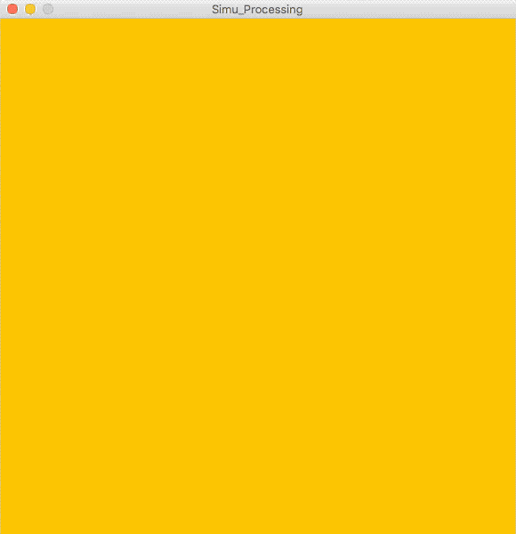
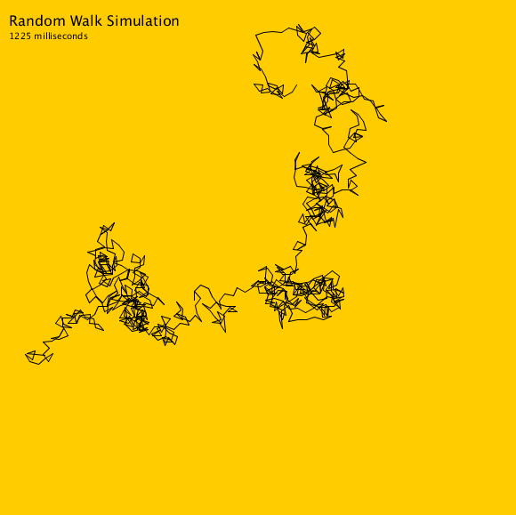

# Polymer Random Walk

A Physics research project with strong computational elements. The code seen here is used to simulate the behavior of flexible polymers, in an attempt to extract relevant statistics that might help us predict future polymer behavior.



## Abstract

In the microscopic world, physical systems are significantly more sensitive to individual interactions than macroscopic ones. Microparticles tend to follow a diffusive motion rather than a ballistic motion, making it harder to predict the dynamics of a system. Here we explore the validity of using computer simulations to substitute real physical systems and predict their dynamical properties using mathematical and probabilistic tools.

We explore flexible polymers in solution and particles undergoing Brownian motion in a one-dimensional medium and show that the systems can be safely approximated by numerical methods involving the generation of random numbers. We show that the anisotropy of flexible polymers’ shapes is mostly due to the random walk nature of the system and not due to intramolecular interactions or self-avoiding effects. We show that the Langevine equation can be used to predict the trajectory of a Brownian particle while ignoring the inertial term, and that a Monte Carlo algorithm can be used to describe more precisely and at a cheaper cost the properties of an equilibrated system.

The paper can be found [here](https://guillonapa.github.io/pages/pdf-views/random-walks.html).

## Code

The simulation itself is a Java program that can be used to generate random walks and statistical measurements of the generated random walks.

Each monomer has a length equal to 1, and is considered to be a straight line. The number of monomers should be relatively large to approximate a flexible polymer. 

The size of the polymers (number of monomers per polymer) can be specified, as well as the dimension on which the polymer operates. There are three dimensions:

-  **Two Dimensional Rectangular:** Each monomer exists in an x-y plane and its direction aligns with the x-axis or the y-axis (in the positive or negatice directions). A monomer and its vertices are not allowed to overlap with any other monomer or its vertices.
-  **Two Dimensional:** Each monomer exists in an x-y plane and its direction is random. The monomers are allowed to overlap each other.
-  **Three Dimensional:** The same as the 'Two Dimensional' case, but in three dimensional space, i.e. each monomer has an x, y, and z component.

## Running Simulations

To run your own simulations clone this repository.

```shell
$ git clone https://github.com/guillonapa/polymer-random-walk.git
```

Once the repository has been cloned, you can modify `SimulationController.java` to create any number of polymers. You can use the `printPolymer()` methods to extract the coordinates of the random walk (printing to the console or to a file), or use the methods specified in `PolymerAnalyzer.java` to extract measurements from the polymer.

Furthermore, you can package the project to use somewhere else.

```shell
$ mvn package
```

This will generate two `jars`, one with the required dependencies included in the `jar`, the other one without them.

## Simulations Usage

As an example, the coordinates of all the monomers in the polymer can be used to simulate a random walk. In this example the simulations were used to generate images of flexible polymers of distinct lengths, such as the one shown below.


