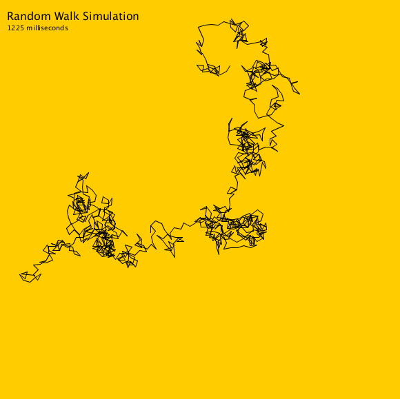

# Polymer Random Walk

A Physics research project with strong computational elements. The code seen here is used to simulate the behavior of flexible polymers, in an attempt to extract relevant statistics that might help us predict future polymer behavior.

## Paper Abstract

*In the microscopic world, physical systems are significantly more sensitive to individual interactions than macroscopic ones. Microparticles tend to follow a diffusive motion rather than a ballistic motion, making it harder to predict the dynamics of a system. Here we explore the validity of using computer simulations to substitute real physical systems and predict their dynamical properties using mathematical and probabilistic tools. We explore flexible polymers in solution and particles undergoing Brownian motion in a one-dimensional medium and show that the systems can be safely approximated by numerical methods involving the generation of random numbers. We show that the anisotropy of flexible polymers’ shapes is mostly due to the random walk nature of the system and not due to intramolecular interactions or self-avoiding effects. We show that the Langevine equation can be used to predict the trajectory of a Brownian particle while ignoring the inertial term, and that a Monte Carlo algorithm can be used to describe more precisely and at a cheaper cost the properties of an equilibrated system.*

The paper can be found [here](https://guillonapa.github.io/pages/pdf-views/random-walks.html). 

## The Code

The simulation itself is a Java program. The user can specify in the code the number of monomers (units) that the polymer will have, and the number of simulations that the program will be run. Then important statistics are calculated and written in a file specified by the user.

## Running Simulations

Download all java classes included in this repository. You will need:

1. SimulationController.java
2. Polymer.java
3. Monomer.java

Then update the final variables and run the program.

```java
public static final String OUTPUT_FILE_NAME = "details-positions.csv";
public static final String FINAL_POSITIONS_FILE_NAME = "final-positions.csv";

public static final int LENGTH_OF_POLYMERS = 1000;
public static final int NUMBER_OF_POLYMERS = 10;
```

The output will be saved to the specified files.

## Sample Image

Images can be generated using the coordinates of all the monomers in the polymer. Here is a screenshot of an animation that shows the growth of a flexible polymer, following its characteristic random walk.


